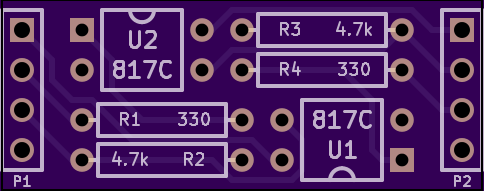
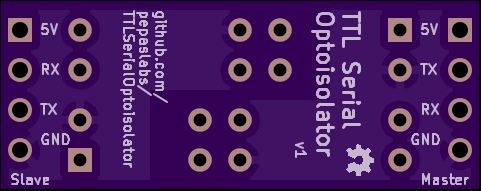

# TTLSerialOptoisolator

A board which provides isolation for a TTL serial TX / RX pair.

## License

This board design is [Open-Source Hardware](http://www.oshwa.org/definition/).  It is licensed under the [MIT License](http://opensource.org/licenses/MIT).  It was designed by Jason Pepas.

# Board design v1

Initial board design.

## Gerbers

[gerbers.zip](releases/v1/gerbers.zip)

## Schematic

[PDF](releases/v1/TTLSerialOptoisolator%20schematic.pdf).

## LED series resistor calculation

Can we find an LED resistor value which works for both 3.3V and 5V TTL levels?

Lite-On LTV-817 datasheet: http://media.digikey.com/pdf/Data%20Sheets/Lite-On%20PDFs/LTV-817_827_847%28M,S,S_TA1%29.pdf

The forward voltage of the LED is typically 1.2V.

* 5V - 1.2V = 3.8V
* 3.3V - 1.2V = 2.1V

Voltage|100Ω|150Ω|220Ω|330Ω|470Ω|680Ω|1kΩ
-------|----|----|----|----|----|----|---
5V|38mA|25mA|17mA|12mA|8mA|6mA|4mA
3.3V|21mA|14mA|10mA|6mA|4mA|3mA|2mA

So 330Ω would be a reasonable choice.
